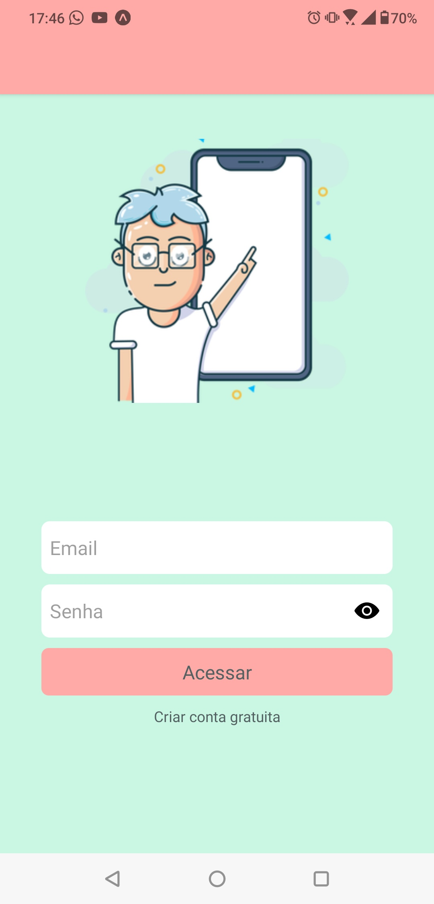

# Meu ponto digital

APP Ponto digital com React-native. 
### Web

## 🚀 Iniciando
No diretório do projeto, você pode executar::
### `yarn start`

---
Codificado com ❤️  por [Gisele Gois](https://github.com/GiseleGois)